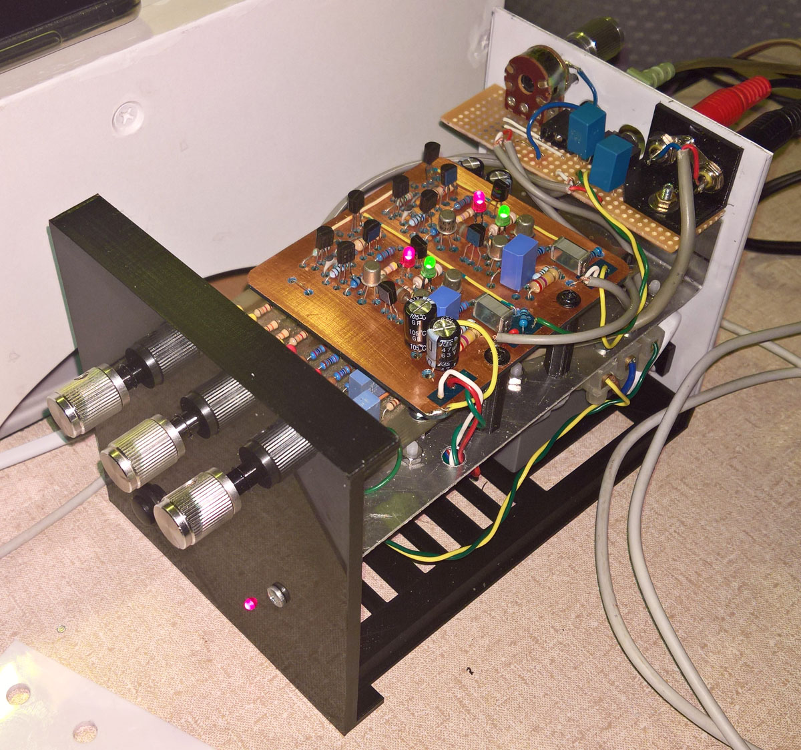
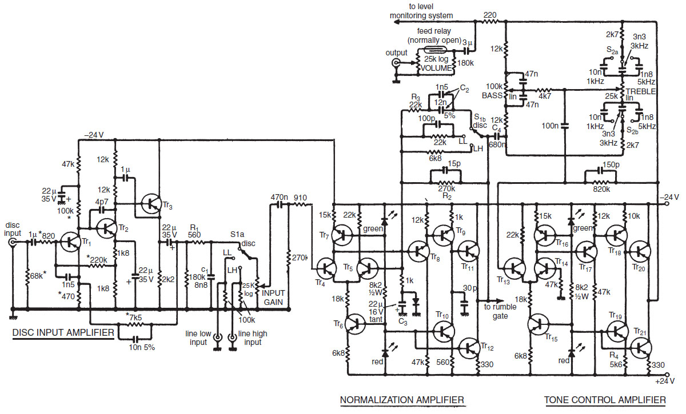
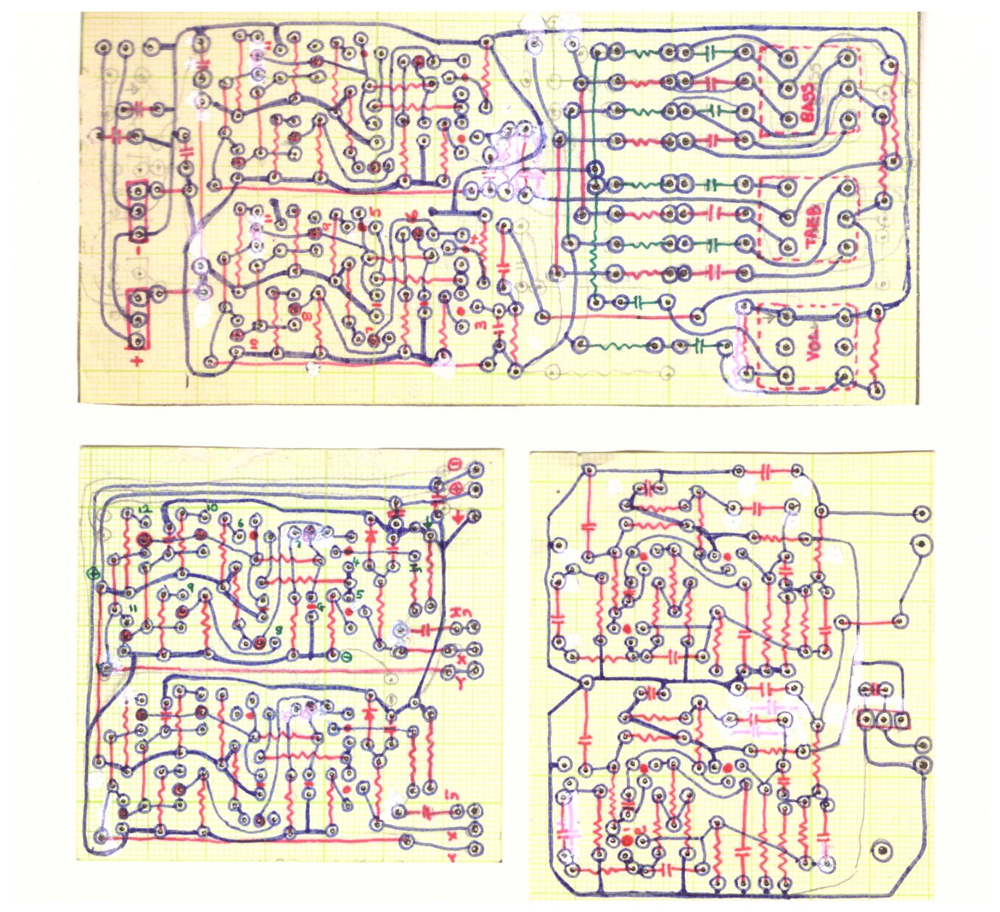
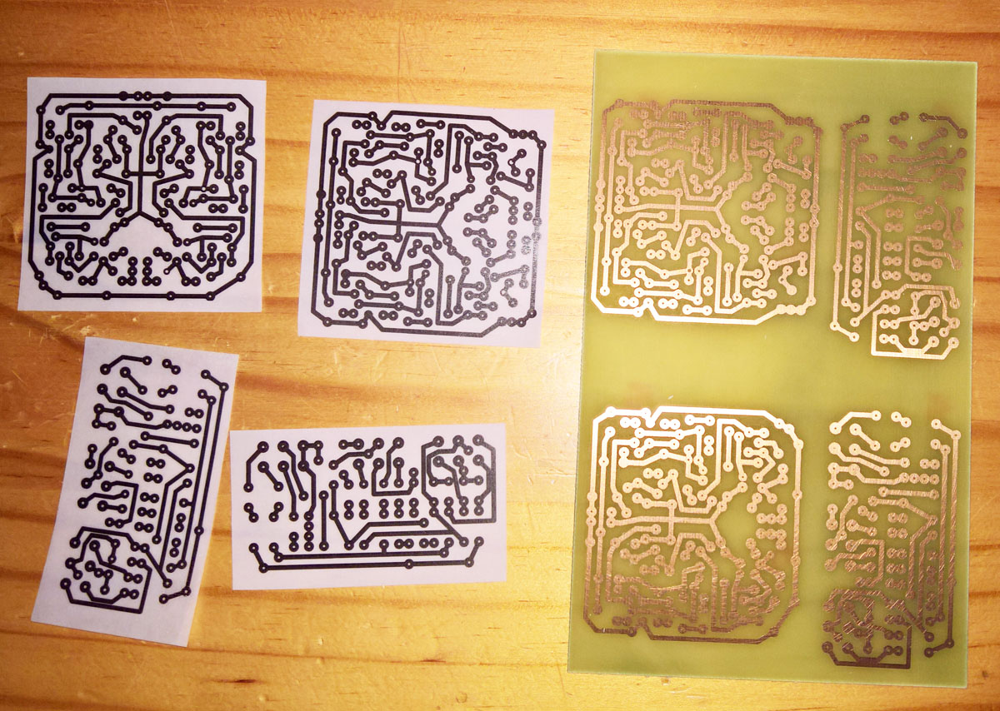
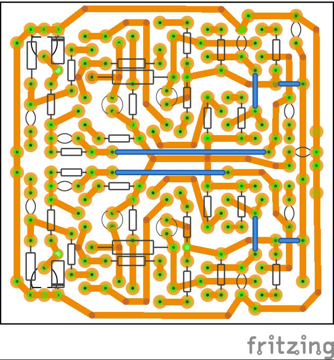
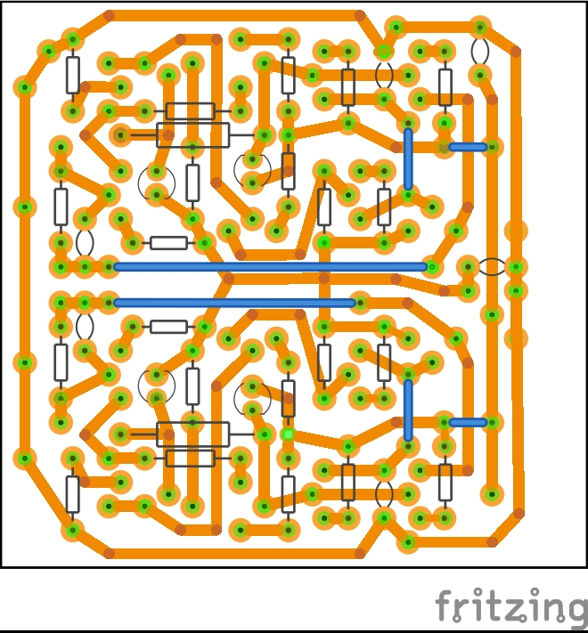
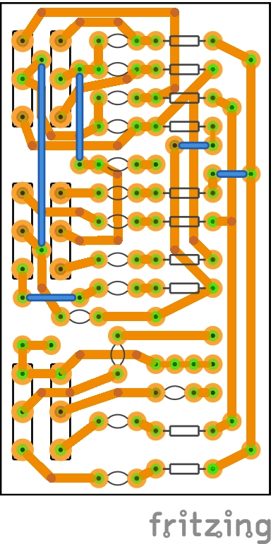

Copyright 1976 November Wireless World An Advanced Preamplifier by [**Douglas Self**](http://www.douglas-self.com/ampins/library/ampartew.htm)

Although Douglas Self is perhaps better known amongst those of a certain age, two of his audio design books are recommended right here on Github: 
[**How to learn modern electronics**](https://github.com/joaocarvalhoopen/How_to_learn_modern_electronics)

This is the most musically sounding preamp I have built. The photograph shows the two normalization and tone control PCB's constructed in the middle 1980's, re-housed in a recent (partially) 3d-printed, case. The input level control is at the back of the case. 

  
   
  	

	
Listening during the past year (2020/2021) to this preamp driving a linear-psu-class-D-amp prompted me to start building a second preamp - the unpopulated pcb have been made and the components obtained. More details are in the [AdvPreAmp2021Build](AdvPreAmp2021Build) folder with also includes the Fritzing design files. (No it is not cool to have to create a schematic, if all that you want is a PCB based on a perfectly good schematic that you already have.) A trick that I use to make the PCB photomasks is to use normal white paper, and after they have been (laser) printed rub some sunflower oil over the print and let it dry for 24 hours.

  
   
  
  

