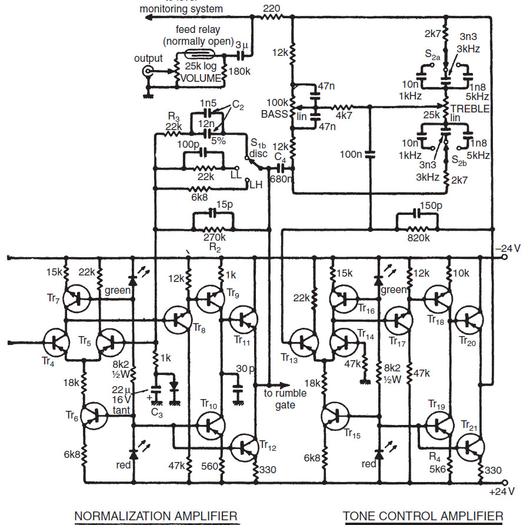

Copyright 1976 November Wireless World An Advanced Preamplifier Douglas Self

http://www.douglas-self.com/ampins/library/ampartew.htm

This is the most musically sounding preamp I have ever built. The photograph shows the two normalization and tone control PCB from the middle 1980's re-housed in a recent case.

  
    

	
